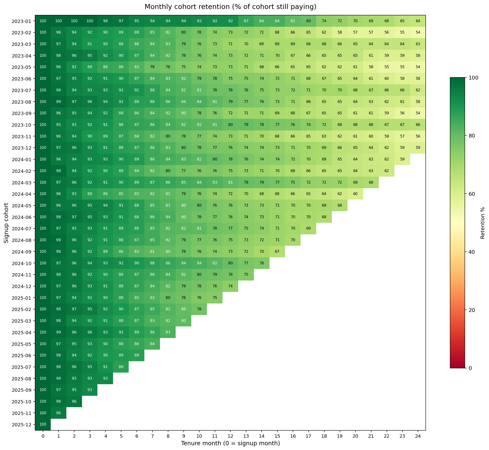
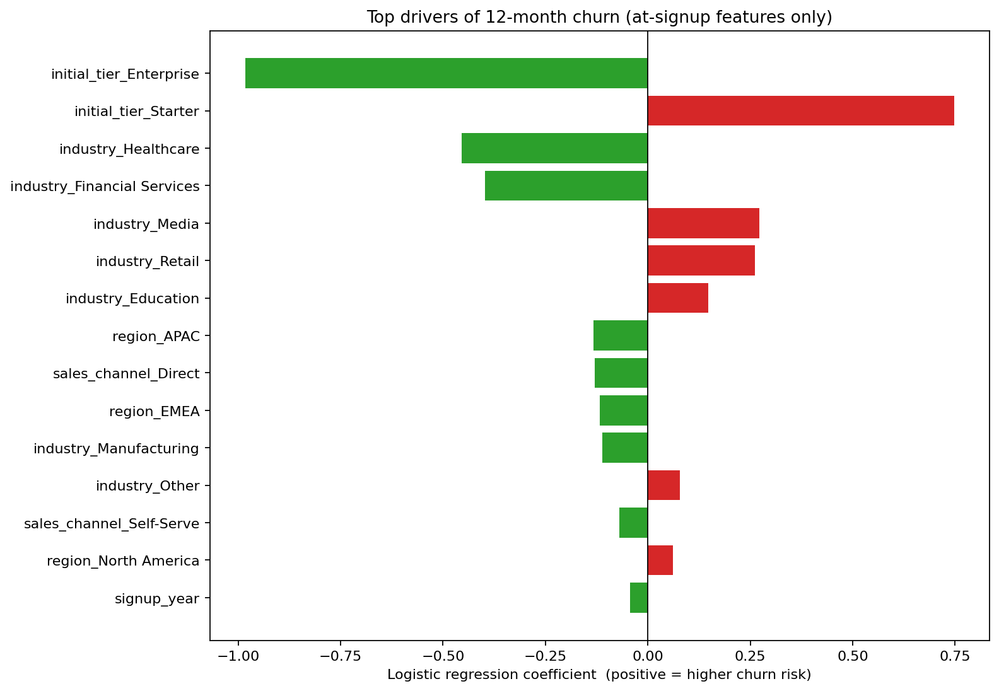

# Customer Revenue & Retention Analytics

> A narrative memo on what drives revenue and retention in a B2B subscription business, written in the working-backwards style. Built on three years of synthetic customer, subscription, and transaction data using SQL, Python, and Tableau.

---

## The question

A subscription business that loses customers faster than it acquires them shrinks no matter how good its sales engine looks on paper. The question this project answers is simple: of the customers we have, who stays, who leaves, who pays the most, and what should we do differently? A leadership team running this business needs a clear picture of revenue concentration, retention, and the levers that move both, so they can decide where to invest in acquisition, where to invest in retention, and which segments deserve a dedicated success team.

## What I built

I generated three years of subscription data covering 8,000 customers across three tiers (Starter $99/month, Growth $499/month, Enterprise $2,499/month), seven industries, and four global regions. I then wrote six analyses in SQL and two Python notebooks to interrogate it. The SQL queries cover cohort retention, customer lifetime value by segment, quarterly net and gross revenue retention with movement decomposition, ABC revenue concentration, churn rate by tenure bucket, and a month-over-month and year-over-year revenue trend. The Python work turns the cohort table into a heatmap and fits a logistic regression that scores 12-month churn risk using only information known at signup. A Tableau dashboard pulls the three most decision-ready views into one screen.

All numbers below are validated by running the SQL against the actual data via DuckDB.

## How I defined the metrics

I used the definitions a finance team would recognize. Gross Revenue Retention is the share of last quarter's customer revenue that we held this quarter, ignoring expansion (it is capped at 100%). Net Revenue Retention is the same calculation including expansion from upgrades, and best-in-class B2B SaaS companies report NRR above 110%. Customer lifetime value is the total net revenue a customer has paid over the observation window. Cohort retention is the percentage of customers from a given signup month still paying in a later month. ABC classification places customers into class A (top 70% of cumulative revenue), B (next 20%), and C (bottom 10%) when ranked by lifetime revenue.

## What I found

Revenue is highly concentrated. The top 17% of customers, 1,374 accounts, drive 70% of the $66M in revenue over the three-year window. The bottom 62% of customers contribute only 10%. This is a textbook 80/20 shape but tighter, which means the named-account list matters more than the long tail. Losing one Enterprise customer costs more than losing forty Starter customers.

Retention is healthy at the top of the funnel but leaks badly at the bottom. Net Revenue Retention stabilized around 112% in 2025, helped by steady upgrades and expansion, and Gross Revenue Retention sat near 96%. Those numbers would put this business in the upper quartile of B2B SaaS benchmarks. But under the average, the picture splits sharply by tier and tenure. Starter customers churn at 38% in their first three months. Growth customers churn at 24% in the same window. Enterprise customers churn at 15%. After the first year the curves flatten, but the damage is done early.



Segment matters as much as tier. Financial Services customers in North America have an average lifetime value of $12,356 and churn at 20%. Retail customers in EMEA have an average LTV of $5,064 and churn at 38%, the worst combination in the dataset. The model fit on at-signup features only (industry, region, tier, channel, discount, signup quarter) reaches a ROC AUC of 0.65, which is modest in absolute terms but useful: it confirms what the descriptive analysis shows. Tier and industry carry the most signal, with Enterprise tier and Financial Services industry pushing risk down, and Starter tier, Retail, and Media pushing it up.



## What I would recommend

The single highest-leverage move is fixing onboarding for Starter customers. The 0-3 month window accounts for 34% of all Starter churn in the dataset, and that share is consistent across industry and region. A reasonable hypothesis is that a meaningful fraction of these customers never reach first value, and an investment in a 30-day activation playbook would compound for years. If the playbook moved the 0-3 month Starter churn rate from 38% to 28%, roughly the level Growth customers see, the carryover into retained revenue at month 12 would be material.

The second move is to harden the Enterprise account list. With 17% of customers driving 70% of revenue, the most valuable thing the customer success team can do is build a named-account retention program for the top 200 accounts: quarterly business reviews, executive sponsors, early-warning signals on usage drops. The model is too coarse to score Enterprise customers individually, but the analytics infrastructure now in place can be extended with behavioral features once they are available.

The third move is to rationalize discounting. Customers acquired with no discount or low single-digit discounts retain at the same rate as customers acquired with 15-20% discounts, but LTV is higher because the price they pay is higher. Discounts that don't change retention are simply revenue given away.

## What this would look like as the next phase

The work above is a static analysis on a 36-month window. Three extensions would move it from project to product. First, embed the SQL into a daily-refreshed dashboard so the metrics are live rather than point-in-time. Second, add behavioral features (login frequency, feature adoption, support ticket volume) to the churn model and re-score the customer base monthly so the customer success team has a fresh risk list. Third, build a holdout-based experimentation framework so the onboarding playbook and named-account programs can be measured against control groups rather than against historical baselines.

## Repository layout

The `notebooks/` directory has the synthetic data generator and the two analytical notebooks. The `sql/` directory has six commented queries, each one runnable directly against the CSVs via DuckDB. The `data/` directory holds the generated CSVs. The `assets/` directory holds the cohort heatmap and the churn-driver chart produced by the notebooks.

## Tools used

PostgreSQL-compatible SQL validated via DuckDB. Python 3 with pandas, NumPy, scikit-learn, and matplotlib. Tableau Public Desktop. The synthetic data generator depends only on the Python standard library.

## How to run

```bash
# 1. Generate the data (writes 3 CSVs into data/)
python notebooks/01_generate_data.py

# 2. Build the cohort heatmap
python notebooks/02_cohort_analysis.py

# 3. Fit and evaluate the churn model
python notebooks/03_churn_prediction.py

# 4. Run any SQL file against the CSVs with DuckDB
python -c "import duckdb; con=duckdb.connect(); \
  con.execute(\"CREATE VIEW customers AS SELECT * FROM read_csv_auto('data/customers.csv')\"); \
  con.execute(\"CREATE VIEW subscriptions AS SELECT * FROM read_csv_auto('data/subscriptions.csv')\"); \
  con.execute(\"CREATE VIEW transactions AS SELECT * FROM read_csv_auto('data/transactions.csv')\"); \
  print(con.execute(open('sql/04_revenue_concentration_pareto.sql').read()).fetchall())"
```
